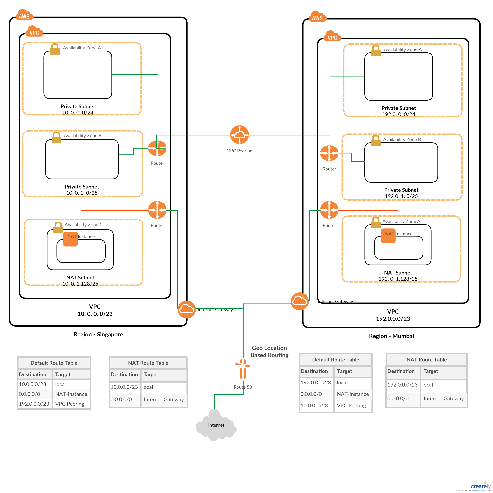

# Network Diagram for NAT enabled VPC's connected on AWS

### Network Diagram Summary
 1. These are two similar VPC deployed in two different regions for High availability
 2. Users will be routed based on a Geo Location Routing Policy configured at Route53
 3. The subnets have been deployed in different regions for High Availability
